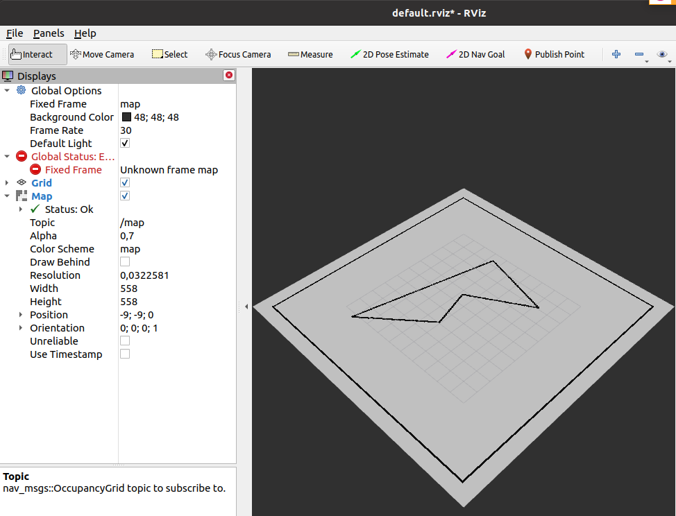
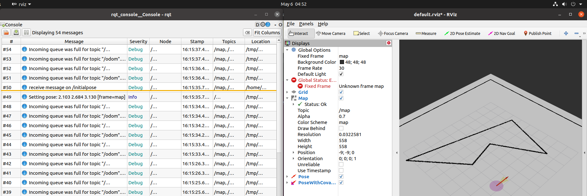
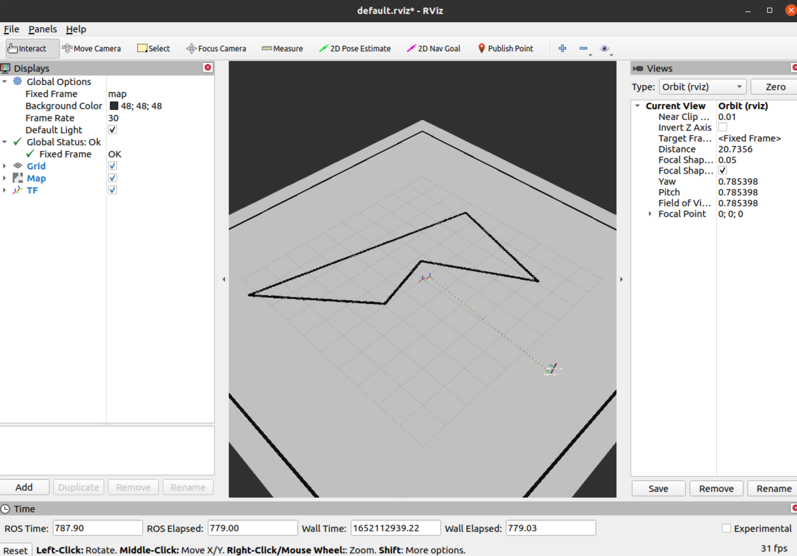

# Mobile Robotics Excercise 6
### 10.5.2022
**Allacher Alexander, Voboril Florentina, Zehetner Clemens**

## 0. Be able to use Git `[20/20]`
Participating: Allacher, Voboril, Zehetner

## 1. Publish the Map `[45/45]`
Participating: Allacher, Voboril, Zehetner

## 2. Initialise self-localisation and trigger driving using RViz `[50/50]`
Participating: Allacher, Voboril, Zehetner

We can view messages in the console. To also see the debug messages, we have to change the level to debug in the configuration.

## 3. Connect self-localisation and planner `[45/45]`
Participating: Allacher

We can see that the tf is shown in rviz.

## 4. Planner `[0/40]`

### 4.1. New Node `[0/50]`

### 4.2. Simple, no Obstacle `[0/50]`

### 4.3. Avoid obstacle `[0/50]`

### 4.4. Plan `[0/100]`

