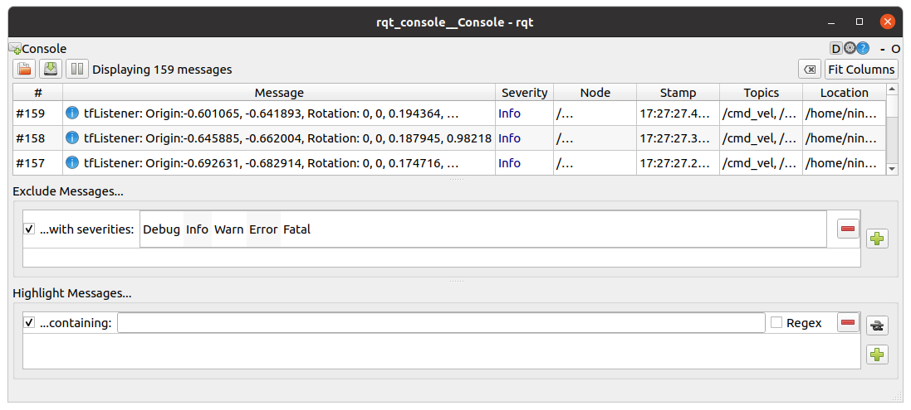
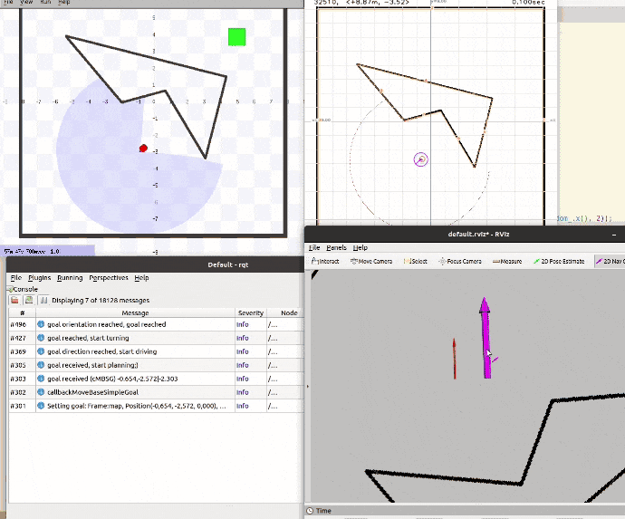

# mr2022

## Team members

* Gerhard Jungwirth
* Lisa-Maria Kipfer
* Nino Wegleitner

## 0. Using git to merge our project (20 / 20 Points)

## 1. Publish the used map (45 / 45 Points)
by Nino Wegleitner

the launchfiles from the line environment from exercise 5 were used:
* `roslaunch mr_local_planner planner.launch stage:=1 mode:=2 world:=line.world`
* `rosrun mr_self_localization mr_self_localization_node cmd:=cmd_vel scan:=base_scan _mode:=1 _initial_with_ground_truth:=true _plot_data:=true _kalman_filter/enable_correction:=true _kalman_filter/enable_data_association:=true _kalman_filter/enable\_prediction:=true _map_image:="$MR_DIR/src/mr2022/mr_self_localization/maps/line.png" _map_lines:="$MR_DIR/src/mr2022/mr_self_localization/maps/line.yml"`

The map is published once every second using a timer callback function. 

## 2. Initialize self-localization and trigger driving using RViz (50 Points)
by Nino Wegleitner

TODO: move goal listener to global planner

## 3. Connect self-localization and planner (45 Points)
by Nino Wegleitner

Tf from map to base_link was already broadcasted in earlier exercise. A tf listener was implemented in the local planner node (TODO: move to global planner). A stamped transformation is saved every time the laser callback function is called.

## 4.0 Planner (20 / 40 Points)

* we are using odom_ instead of self-localisation in the planner currently
* Planner can be operated using RViz
* see screenshot in 4.2 below

## 4.1 New Node (50 Points)

* Similar behaviour as in local-planner
    * subscribe to `/odom`, `/goal` and `/move_base_simple/goal`
    * publish to `/cmd_vel`
* State-machine-based simple goto (as described for CPP node below)
* `rosrun mr_goto mr_goto.py`

## 4.2 Simple, No Obstacle (50 / 50 Points)

State Machine based simple approach:

1. *INIT*: start state machine, start planning
2. *TURN*: turn towards goal location
3. *STRAIGTH*: drive towards goal location in a straight line
4. *FINAL_ORIENTATION*: turn towards goal orientation
5. *NA*: turn off local planner and remain idle

