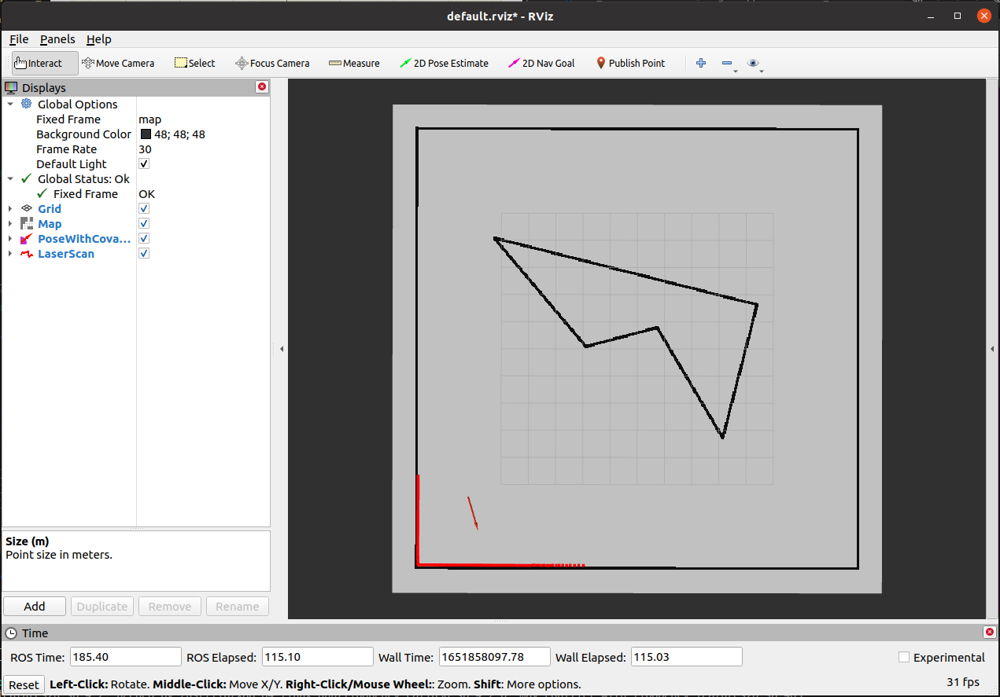
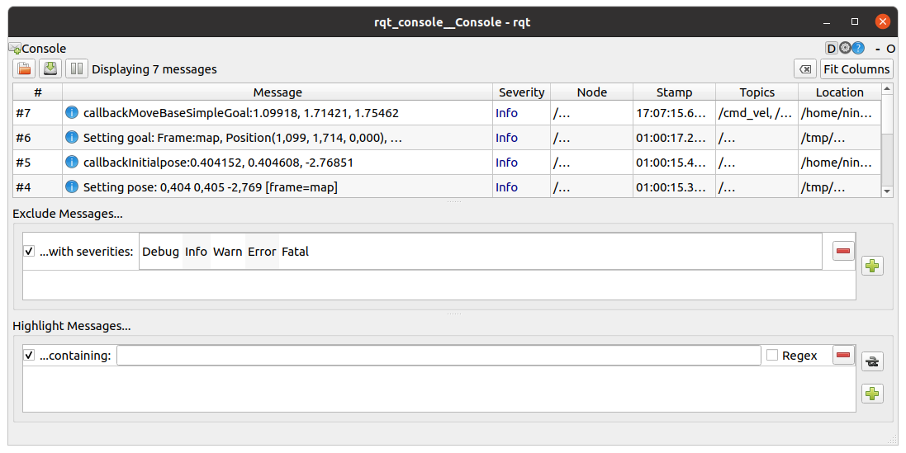
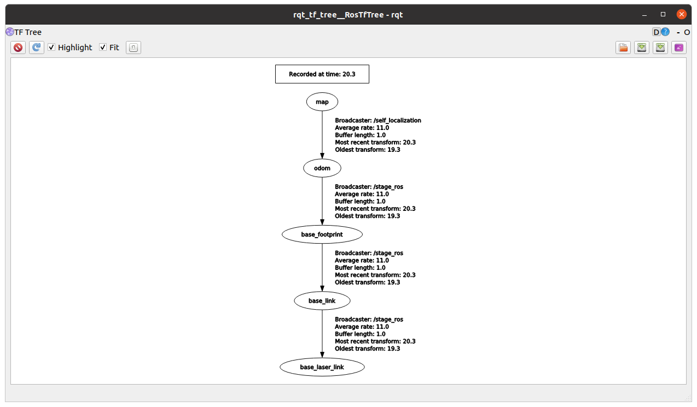
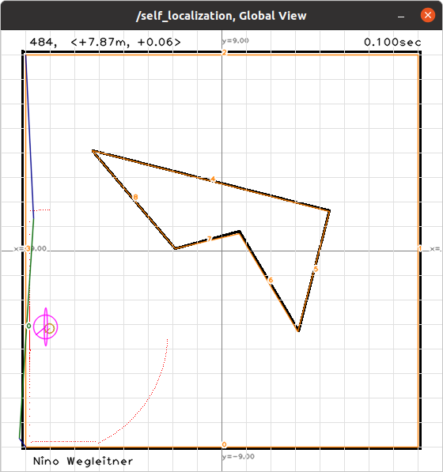

# mr2022

## Team members

* Gerhard Jungwirth
* Lisa-Maria Kipfer
* Nino Wegleitner

## 0. Using git to merge our project (20 / 20 Points)

## 1. Publish the used map (45 / 45 Points)
by Nino Wegleitner

the launchfiles from the line environment from exercise 5 were used:
* roslaunch mr_local_planner planner.launch stage:=1 mode:=2 world:=line.world
* rosrun mr_self_localization mr_self_localization_node cmd:=cmd_vel scan:=base_scan _mode:=1 _initial_with_ground_truth:=true _plot_data:=true _kalman_filter/enable_correction:=true _kalman_filter/enable_data_association:=true _kalman_filter/enable\_prediction:=true _map_image:="$MR_DIR/src/mr2022/mr_self_localization/maps/line.png" _map_lines:="$MR_DIR/src/mr2022/mr_self_localization/maps/line.yml"

The map is published once every second using a timer callback function. 

## 2. Initialize self-localization and trigger driving using RViz (50 Points)
by Nino Wegleitner

TODO: move goal listener to global planner

## 3. Connect self-localization and planner (45 Points)
by Nino Wegleitner

Tf from map to base_link was already broadcasted in earlier exercise. A tf listener was implemented in the local planner node (TODO: move to global planner). A stamped transformation is saved every time the laser callback function is called.
