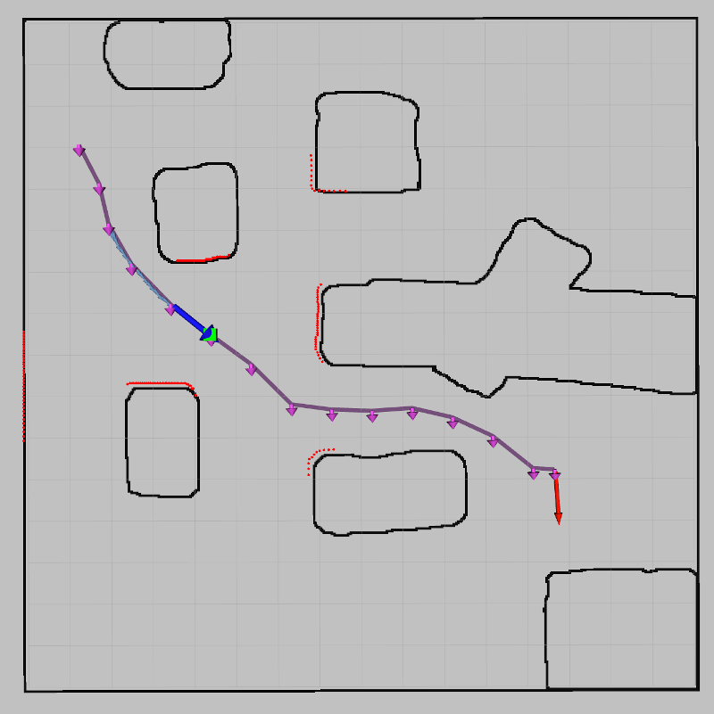

# mr2022
_Team blue_

## Team members
* Daniel
* Luigi
* Felix
* Andreas

## How to start

### Dependencies
```
scipy~=1.8.0
scikit-image~=0.19.2
pyyaml~=6.0
rospkg~=1.4.0
```

### Basic startup
1. `roslaunch stage_ros world.launch world:=cave.world`
2. `roslaunch mr_launch goto.launch`
* * Optional: add argument `map:=cave` or `map:=line`

### How to use the GlobalPlanner
1. Optional: Set `2D Pose Estimate` using RViz
2. Set `2D Nav Goal` using RViz
3. You should see the path in purple

## Documentation
### Publish the used map. (45 Points; Implemented by Daniel)
1. Start like described in _Basic startup_.
2. Map as published on topic `/map` is shown in RViz. You can enable the topic `/map_ref` to compare with a version published by map_server.
3. Also see images below, they show the map in the background.

### Initialize self-localization and trigger driving using RViz (50 Points)
1. Start like described in _Basic startup_.
2. Optional: Set `2D Pose Estimate` using RViz.
3. Set `2D Nav Goal` using RViz.
4. You will see the `2D Pose Estimate` visualized with a green arrow (if it was set).
5. You will see the `2D Nav Goal` visualized with a red arrow.
7. Wait for some seconds and you will see the path from the global planner visualized in purple.
7. The robot starts driving and the ground-truth odometry is shown with history as light blue arrows.



### Connect self-localization and planner (45 Points)
1. Start like described in _Basic startup_.
2. You will see the current pose visualized with a blue arrow.
3. You can additionally see the TF tree visualized.

### Planner (Implemented by Felix)
* Our planner is using our self-localization (20 Points):
* * It does that by subscribing to the TF tree and reading the transformation for every controller iteration.
* Your planner can be operated with Rviz (20 Points)
* * See section in _Initialize self-localization and trigger driving using RViz_.

#### New Node
* For implementing the planner in a newly created node, you will get a reward. (50 Points).
* * We have added separate nodes.

#### Simple, no Obstacle (Implemented by Luigi,Felix)
1. Start like described in _Initialize self-localization and trigger driving using RViz_.
2. You will see the robot tracking the global path by aiming to an intermediate waypoint (green marker). (25 Points)
3. Once reached the goal location it starts turning inplace to align with the correct pose. (25 Points)
4. The following animation shows the local planner in action (*speed x2*).


#### Avoid obstacle (Implemented by Luigi)
* Your vehicle can drive to a goal location even if there is obstacle with 1x1m (movable box) in size in between. (25 Points)
  * If the local planner is not able to navigate to the next waypoint because it is obstructed it switches to an alternative controller.
* Your vehicle can drive to a goal location even if there is a cave obstacle such the one [-5,-3] in between. (25 Points)
* * This obstacle is already part of the map and therefore avoided by the global planner already (see below).

#### Plan (Implemented by Andreas)
* Write a node or modify the planner and/or self-localization to plan a path to the goal location using waypoints and publish it as ROS nav_msgs/Path message. (50 Points)
* * Our global planner implementation is based on costmap functions from [f1tenth_maps](https://github.com/CPS-TUWien/f1tenth_maps) as developed by F1tenth team of TU Wien 2020-2022.
* * * It erodes the drivable area (dilates the obstacles by n pixels).
* * * Then the distance to the target is calculated for every pixel of the map that is not obstructed. (Note it does not terminate when the start is reached. We know that this could be improved for faster calculation.)
* * * The distance map is blurred by a gaussian kernel to get _nicer_ trajectories in the next step. With it is also avoided going close to the the borders with a certain weight.
* * * From the starting position the path to the target is generated by descending values of the distance map.
* * * Spline interpolation is not implemented (however was prepared to do so).
* * * Equidistant (based on number of 8-connected pixels) are published as waypoints.
* * The path is planned and published to `/waypoints` by the global planner.
* * Note that we publish an orientation at each waypoint, however is it only considered by the local planner for the terminal waypoint to match the orientation of the `2D Nav Goal`. (We know that the orientation could be filled with a proper value.)
* Make the local planner to follow the nav_msgs/Path. (50 Points)
* * The path is followed by the local planner (see above).

