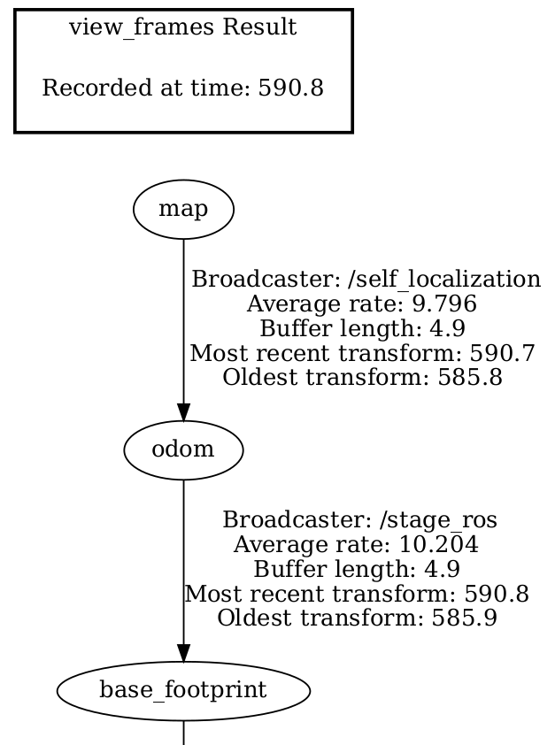
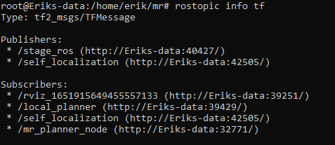
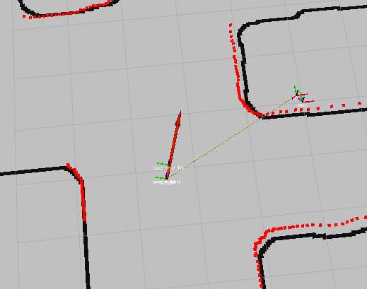
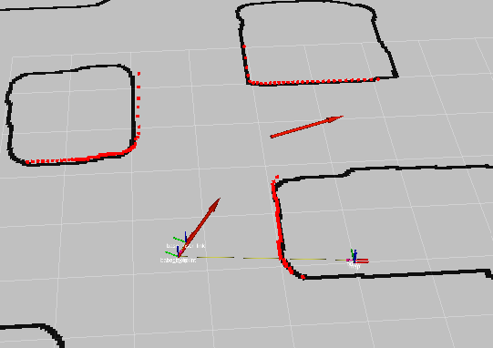
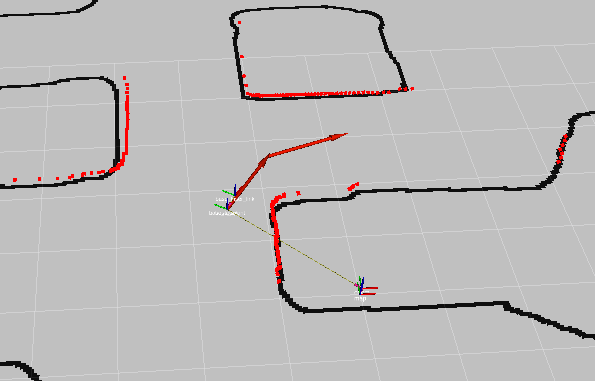
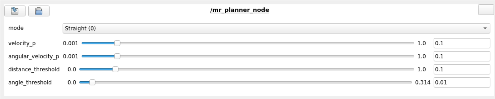
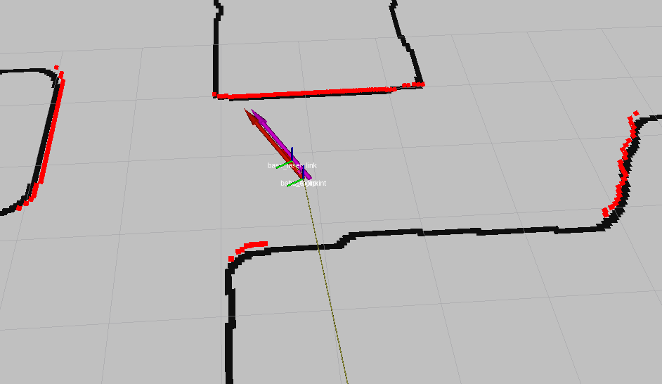
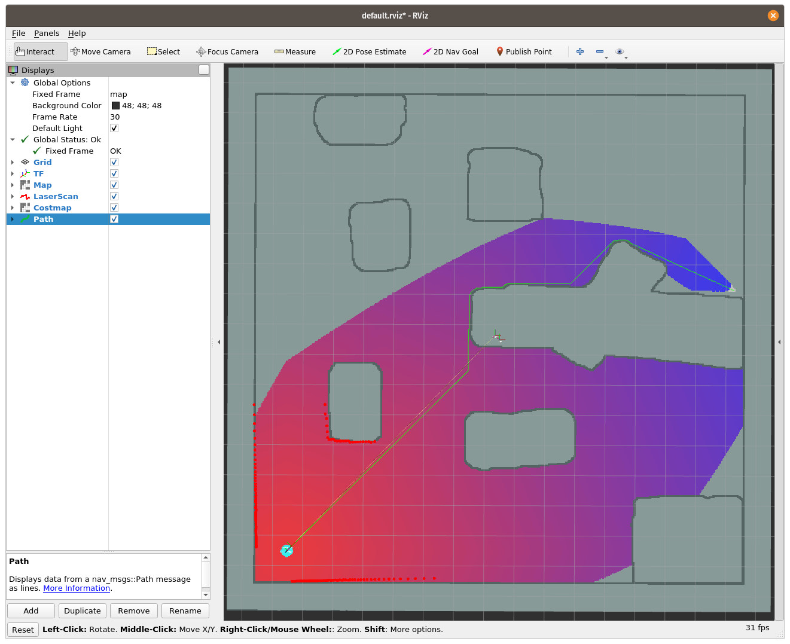

# mr2022

## Team members
* Alexander Lampalzer
* Erik Lundell

# Tasks

## 1. Publish the used map. (45 Points)
* By: Alexander Lampalzer


Self-Localization Visualization and rviz side-by-side. 

## 2. Initialize self-localization and trigger driving using RViz (50 Points)

### 2.1 `/move_base_simple/goal` (25 Points)

* By: N/A

TODO

### 2.1 `/initialpose` (25 Points)

* By: Alexander Lampalzer


rqt_console showing the initialpose beeing sent by `rviz` and received by `self_localization`. After setting the verbosity level of self_localication to debug, the message can be displayed in `rqt_console`.

## 3. Connect self-localization and planner (45 Points)

* By: Alexander Lampalzer



The above images shows the transformation from `map` to `odom` beeing broadcasted by the self-localization node. Other transformations have been cut off to save space.

TODO: listen to the tf in your planner.

## 4. Planner

### 4.0.1 Your planner is using your self-localization (20 Points)

* By: Erik Lundell

 

The image to the left above show that the planner node is listening to the tf broadcast. Because of this, the node does not listen to the topic /pose_estimation directly. To the right is a screenshot of Rviz with a red arrow marking the self localization pose.

### 4.0.2 Your planner can be operated with Rviz (20 Points)

 
* By: Erik Lundell
The image above shows two screenshots of how the robot rotates towards the goal (the red arrow in front of the robot) and then moves towards it.

## 4.1 New Node (50 Points)

* By: Erik Lundell


The planner was implemented in it's own node, mr_planner. Some configurable parameters were also added as seen in the screenshot of rqt_reconfigure above. the planner is easiest run with 'roslaunch mr_launch/planner.launch'

## 4.2 Simple, no Obstacle

### 4.2.1 and 4.2.2 Your vehicle can drive to a goal location, stops there and turns into the correct pose. (50 Points)



A local planner that can drive in a straight path towards a goal pose was implemented as a state machine in the planner node. The control outputs are proportional to the difference between the current pose and the goal (and capped at 0.5).  
The screenshot shows how the robot (red arrow) has stopped and rotated to the goal pose (purple arrow). There is a small mis-alignment because the planner is configured to stop when within a 10 cm radius of the goal, however this can be changed with rqt_reconfigured as seen above. One weakness of the planner is that it does not account for overshooting the goal.

TODO

## 4.3 Avoid obstacle

### 4.3.1 Your vehicle can drive to a goal location even if there is obstacle with 1x1m (movable box) in size in between. (25 Points)

### 4.3.2 Your vehicle can drive to a goal location even if there is a cave obstacle such the one [-5,-3] in between. (25 Points)

## 4.4 Plan

### 4.4.1 Write a node or modify the planner and/or self-localization to plan a path to the goal location using waypoints and publish it as ROS nav_msgs/Path message. (50 Points)

* By: Alexander Lampalzer



Above image shows a screenshot of rviz with a path and a costmap from the current robot pose to the target, sepcified by "2D Nav Goal". The path and costmap are generated by th newly created `mr_global_planner` node.

To start the global planner, run:

```
rosrun mr_global_planner mr_global_planner_node
```

Use the tool "2D Nav Goal" in rviz to specify a target for the global plan. The results will then be published at `/global_planner/costmap` and `/global_planner/path`.