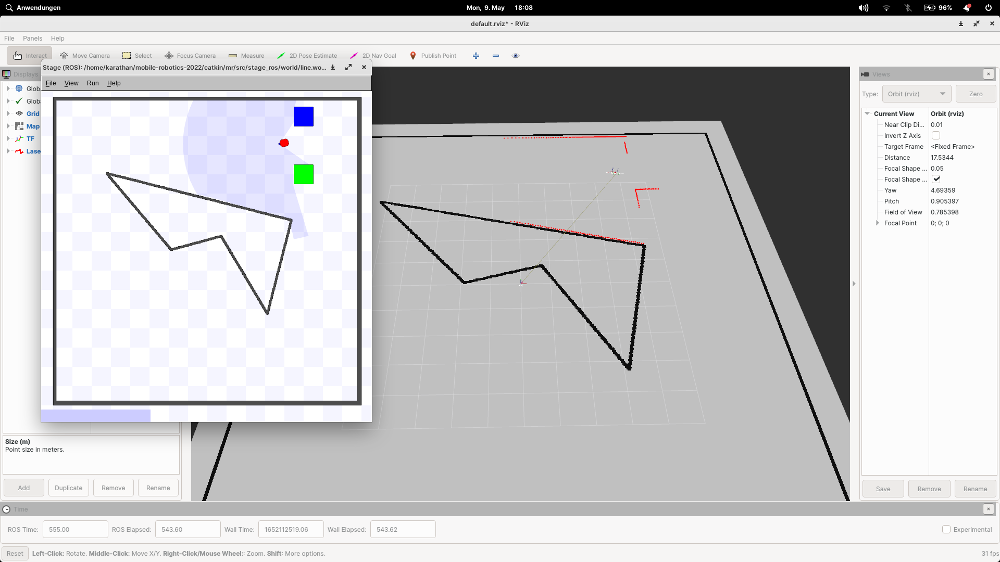
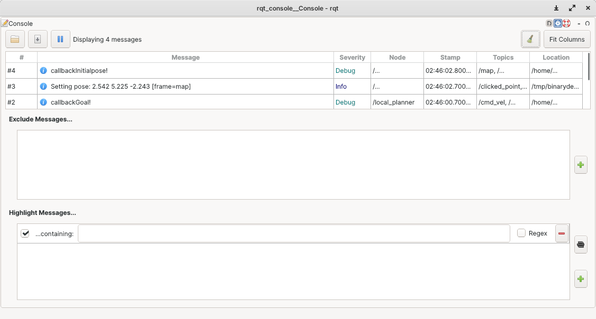
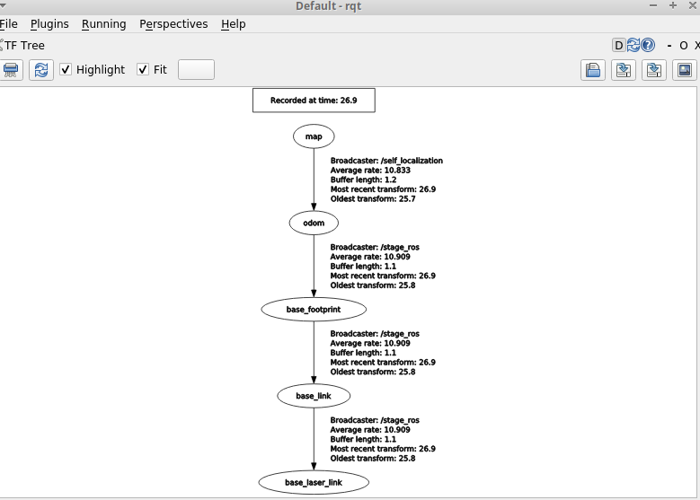

# mr2022
## Team members

Philipp-Alexander Auer, Patrik Szabó

## 0. `git merge` - `[20/20]`

Participants: Philipp-Alexander Auer, Patrik Szabó

While using the version control software `git` we used branches to develop individual features/tasks and used `git merge` as can be seen in our `git log`.

## 1. Publish the used map - `[45/45]`

Participants: Philipp-Alexander Auer, Patrik Szabó



## 2. Initialize self-localization and trigger driving using RViz - `[50/50]`

Participants: Philipp-Alexander Auer, Patrik Szabó

Sending messages using `ROS_DEBUG` can be e.g. seen using `rqt_console`:



## 3. Connect self-localization and planner - `[45/45]`

Participants: Philipp-Alexander Auer, Patrik Szabó

By using a TransformBroadcaster inside the self_localization_node, we were able to publish the transform between the map frame and the odometry frame. This broadcasted message was then "caught" using a listener in the local_planner_node. The image shows the tf-tree connection between the map and odom frames. A visualization of this can also be seen in (1. Publish the used map)



## 4. Planner `[20/40]`

Participants: Philipp-Alexander Auer, Patrik Szabó

 * Our planner is not using our self-localization
 * We can operate the planner using `rviz`

## 4.1 New Node `[50/50]`

Participants: Philipp-Alexander Auer, Patrik Szabó

A new node `mr_custom_planner_node` was added which contains the control logic for our planner.

## 4.2 Simple, no Obstacle `[50/50]`

Participants: Philipp-Alexander Auer, Patrik Szabó

To start everything:
```
roslaunch stage_ros world.launch world:=line.world
rosrun mr_local_planner mr_custom_planner_node scan:=base_scan
rosrun mr_self_localization mr_self_localization_node cmd:=cmd_vel scan:=base_scan _mode:=1 _initial_with_ground_truth:=true _plot_data:=true _reinitialize:=true _map_image:="$MR_DIR/src/mr-20.04/mr_self_localization/maps/line.png" _map_lines:="$MR_DIR/src/mr-20.04/mr_self_localization/maps/line.yml"
```

To use `rviz` we provide a config file `mr_local_planner/config.rviz`.

We connected Rviz to the planner, by "posting" a goal pose on the topic move_base_simple/goal. This triggers a callback in the custom_planner_node, which in turn saves the position passed down from rviz inside a goal_ variable. This variable is used in the planner node, to guide the robot towards the selected point on the map. Our approach consists of calculating the angle between the direction the robot is facing, and the goal point. The robot is then turned to face the goal, and starts driving in a straight line. We use a simple iteration "timer" to counteract the oversteering that happens, when the angular velocity hasn't been fully reset yet. When a new goal is set, the driving resets, and a new heading angle is calculated.

## 4.3 Avoid Obstacle `[0/50]`

Participants: /

This was not implemented

## 4.4 Plan `[0/100]`

Participants: /

This was not implemented