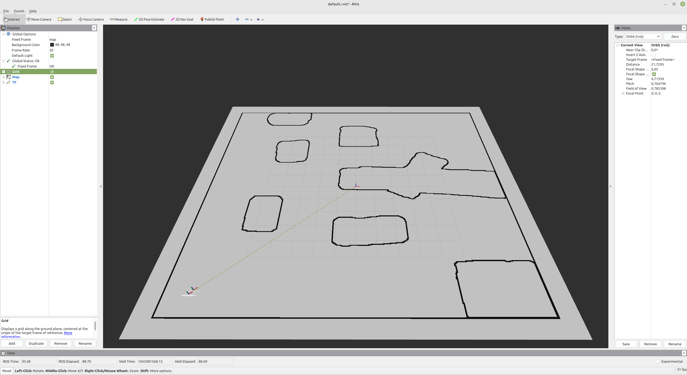
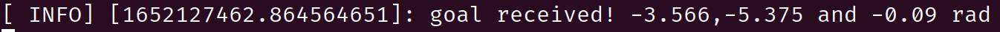
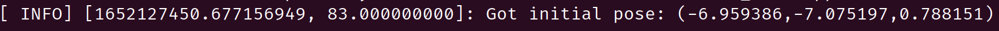
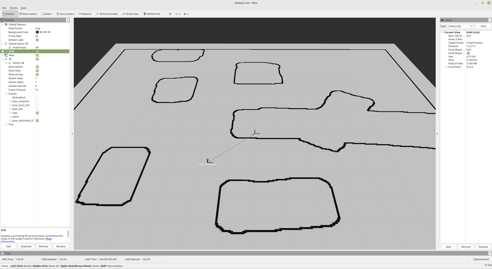
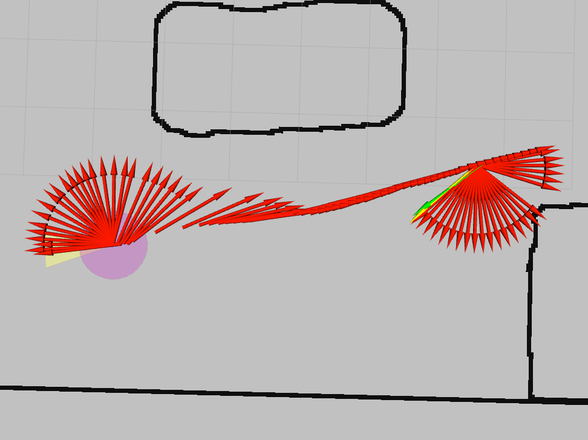
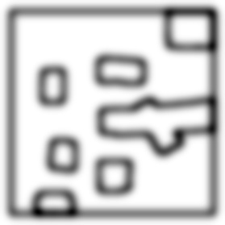
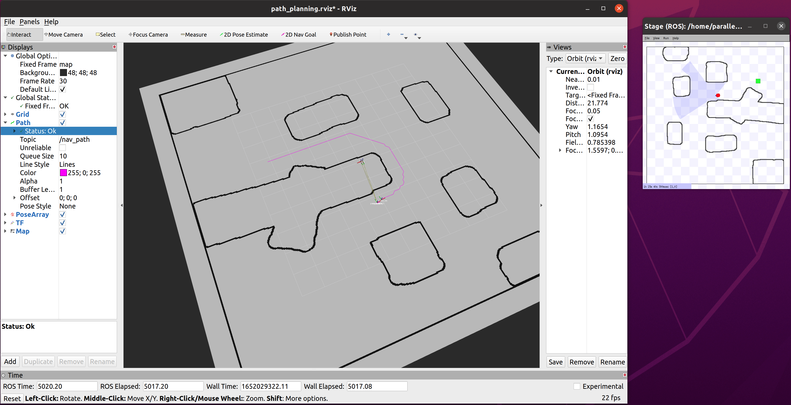

# mr2022
## Team members
Georg Amstetter, Menno Haász, Jan Hadl, Florian Pressel

## Documentation

### Startup

Without path planner (4.4):

`roslaunch mr_goto goto.launch stage:=1 world:=cave.world mode:=1 use_path:=false`

`roslaunch mr_self_localization self_localization.launch map:=cave`

`rosrun rviz rviz`

With path planner (4.4):

`roslaunch mr_goto goto.launch stage:=1 world:=cave.world mode:=1`

`roslaunch mr_self_localization self_localization.launch map:=cave`

`roslaunch mr_path_planner path_planner.launch`

`rosrun rviz rviz`

### 1. Publish the used map
Implemented By: Florian Pressel

We publish the map that is used by the self localization node as a `nav_msgs::OccupancyGrid` to the `/map` topic every 10 spins, so once every second, given that the main loop of `mr_self_localization` runs at 10 Hz. This topic can then be subscribed to in RViz to display the map, and is subscribed to by the `mr_path_planner` node for the exercise part 4.4 as a basis for the path planning. The visualization in RViz can be seen in the following figure: 

### 2. Initialize self-localization and trigger driving using RViz
Implemented By: Florian Pressel

We subscribe to `/move_base_simple/goal` and `/initialpose` in the respective nodes (`mr_goto` and `mr_path_planner` for the former, `mr_self_localization` for the latter), interpret
the received messages and log the received poses via `ROS_INFO()`. Examples for these messages from the `mr_goto` and `mr_self_localization` nodes can be seen below:

### 3. Connect self-localization and planner
Implemented By: Florian Pressel

We broadcast the robot's estimated pose in the `broadcastEstimatedPoseAsTF` method of `self_localization_node.cpp` as a TF from `map` to `pose_estimated_tf`. The TF can then be seen with the TF display in RViz, and is read at every spin in the `mr_goto` and `mr_path_planner` nodes to have the most recent pose estimate available. The broadcasted TF can be seen in RViz in the following figure:

### 4. Planner
Implemented By: all of us

Using the self-localization in our planner is fulfilled by using its published pose estimate and map, as described in the sections 1 and 3. Operating the planner with RViz is achieved by subscribing to `/move_base_simple/goal` as explained in section 2.

#### 4.1 New Node
Implemented By: Florian Pressel and Jan Hadl

We implemented the movement logic and motion calculation for exercise parts 4.2 and 4.3 in a new node called `mr_goto`. The path-finding for exercise path 4.4 is implemented in an additional node, `mr_path_planner`. 

#### 4.2 Simple, no Obstacle
Implemented by: Georg Amstetter

To reach a goal location, the movement logic in `mr_goto` (found in the `bug1()` function) first turns the robot to face the goal, then drives towards it until it reaches a certain distance threshold (`0.2` meters), slowing down as it gets closer to the goal. It then corrects its rotation until the final goal pose is reached. In the screenshot below, you can see the odometry history of one such example of a robot movement, with the initial pose to the left, the goal in green to the right, and the robot's final estimated pose in yellow:

#### 4.3 Avoid obstacle
Implemented by: Menno Haász, Jan Hadl

Driving around cave obstacles is achieved with the path planning implemented in exercise part 4.4, and an example can be seen in the corresponding section of this document.

#### 4.4 Plan
Implemented by: Jan Hadl

The path planner is implemented in its own `mr_path_planner` node. It uses the A* algorithm (implemented by the MicroPather library: https://github.com/leethomason/MicroPather) to determine a path to the goal. The map published as a `nav_msgs::OccupancyGrid` by the `mr_self_localization` node is used as a grid. It can be scaled down (configurable with the `map_scale` parameter) to increase the grid size, and blurred multiple times with a Gaussian blur (`map_blur_iter` and `map_blur_size` parameters) to create buffer zones around obstacle walls. The planner then considers all grid cells with a brightness value below a certain threshold (`occupancy_thres` parameter) as inaccessible. Finally, whether diagonal movement across cells is allowed or not can be controlled with the `diagonal_move` parameter. 

The figure below shows the grid used by the path planner, scaled to one fourth of the map's resolution, and blurred for 30 iterations with an 11x11 kernel:

The `mr_path_planner` node publishes the calculated path to the goal as a `nav_msgs::Path` object to the `/nav_path` topic on every spin. This topic can be visualized in RViz as a Path display, and is subscribed to by the `mr_goto` node, which, if the `use_path` parameter is set to `true`, follows the path to the goal instead of driving straight to it as described in section 4.2. It simply picks the $k$-th point on the path as an intermediate goal (configurable with the `path_lookahead` parameter) until the path has a length shorter than $k$, at which point the goal is directly targeted. The remaining movement logic is identical to the one described in previous sections. 

In the following figures, the navigation process can be seen in full. At first, a goal is selected (the purple arrow), then the robot can be seen following the path to the goal (the purple line) and finally, the robot can be seen rotating to its correct goal pose:

## Achieved Points

|                              Task                              | Points |
|:--------------------------------------------------------------:|:------:|
|                     1. Publish the used map                    |   45   |
| 2. Initialize self-localization and trigger driving using RViz |   50   |
|            3. Connect self-localization and planner            |   45   |
|                           4. Planner                           |   40   |
|                          4.1 New Node                          |   50   |
|                     4.2 Simple, no Obstacle                    |   50   |
|                       4.3 Avoid obstacle                       |   50   |
|                            4.4 Plan                            |   100  |
|                            GIT merge                           |   20   |
|                              Total                             |   450  |
