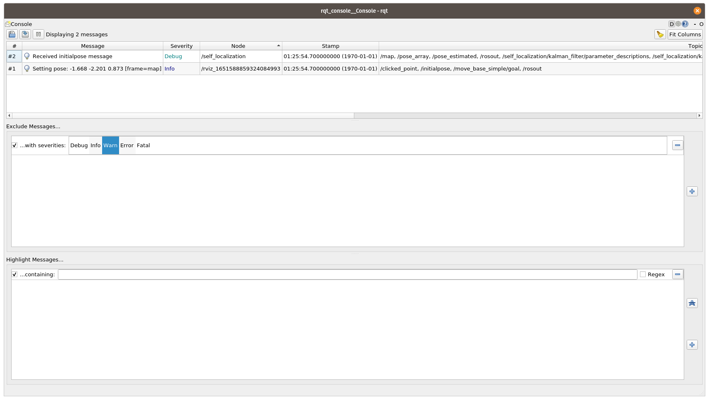

# mr2022

## Team members
* Alexander Lampalzer
* Erik Lundell

# Tasks

## 1. Publishing the map
* By: Alexander Lampalzer

Self-Localization Visualization and rviz side-by-side. 

## `/initialpose`
* By: Alexander Lampalzer

rqt_console showing the initialpose beeing sent by `rviz` and received by `self_localization`. After setting the verbosity level of self_localication to debug, the message can be displayed in `rqt_console`.