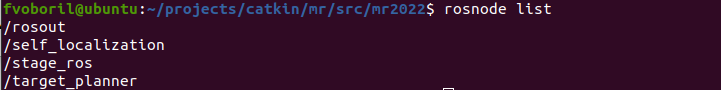
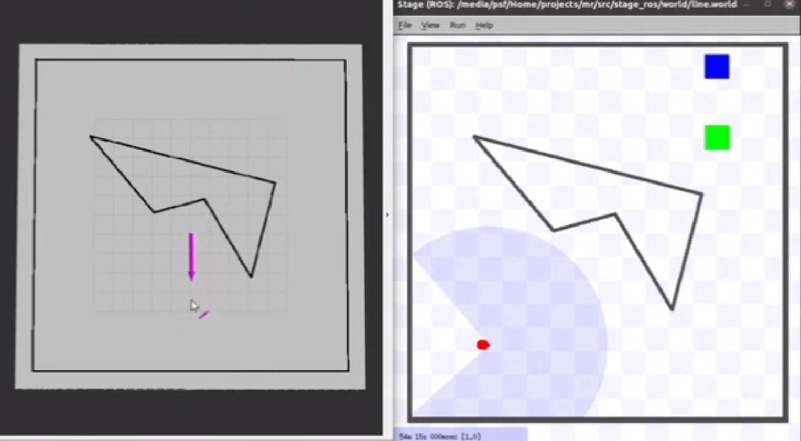
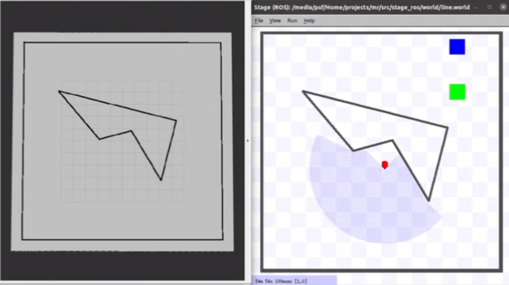

# Mobile Robotics Excercise 6
### 10.5.2022
**Allacher Alexander, Voboril Florentina, Zehetner Clemens**

Overall we reached 20 + 45 + 50 + 45 + 40 + 50 + 50 = **300 Points**.
The work was equally distributed among all team members.

To start our project, run 
`roslaunch mr_local_planner target_planner.launch stage:=1 map:=line`

To start RViz
`rosrun rviz rviz`

## 0. Be able to use Git `[20/20]`
Participating: Allacher, Voboril, Zehetner

## 1. Publish the Map `[45/45]`
Participating: Allacher, Voboril, Zehetner

We publish the map on the topic /map once every second. We had to take care that the scaling and the orientation of the map is correct.

## 2. Initialise self-localisation and trigger driving using RViz `[50/50]`
Participating: Allacher, Voboril, Zehetner

We can view messages in the console. To also see the debug messages, we have to change the level to debug in the configuration.

## 3. Connect self-localisation and planner `[45/45]`
Participating: Allacher

We can see that the tf is shown in rviz.

## 4. Planner `[40/40]`
Participating: Allacher, Voboril, Zehetner

We are using our self localisation and we can operate the planner with rviz.

### 4.1. New Node `[50/50]`
Participating: Zehetner

As it can be seen on the screenshot, we created the new node *target\_planner\_node*.

### 4.2. Simple, no Obstacle `[50/50]`
Participating: Allacher, Voboril, Zehetner

First we selected the target in rviz:

And then the robot is driving to the target and rotating into the goal direction.

### 4.3. Avoid obstacle `[0/50]`

### 4.4. Plan `[0/100]`