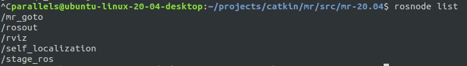

# 6. GoTo | mr2022

## Team 'cyan' members
* Schmidt, Franz
* Windischbauer, Johannes

## Documentation

### 0. System launch
The following launches will start all necessary nodes and also opens RViz with a predefined setup for visualization.

1. `roslaunch stage_ros world.launch world:=line.world`
2. `roslaunch mr_goto goto.launch`

### 1. Publish the used map (45p)
The used maps are being published by the map_server node. To be able to utilize these maps I created the necessary yaml files and moved everything into mr_launch/cfg/maps.
The map_server node is included in the mr_goto/launch/goto.launch file and the maps are configurable with the map argument. The default map is line.

### 2. Initialize self-localization and trigger driving using RViz (50p)
The self-localization node subscribes to the `/initialpose` topic and listenes for the event which can be triggered with RViz. The local-planner node subscribes to the `/move_base_simple/goal` topic which as well can be triggered with Rviz.

### 3. Connect self-localization and planner (45p)
The planner repeatingly updates the transform for the robot pose which is provided by the self-localization node. The driving can be triggered from RViz by setting the goal-position. Also the TF tree can be visualized to see the complete transformation from map to base-link.

### 4. Planner (40p)
The planner is using our self-localization (20p) and can be operated with RViz (20p).

#### 4.1 New Node (50p)
The mr_goto node is a new python node and already connects to the scan messages and publishes velocity commands. At the beginning the node was overcomplicated and utilized a wall follow algorithm implemented in another course. However, we decided against trying to avoid obstacles with our wall follow algorithm and instead focused on a simple go to implementation.
Running `rosnode list` results in the following output.

#### 4.2 Simple, no Obstacle (50p)
Launch the environment as described in section 0. Choose an arbitrary location with no obstructions and set it via RViz. The robot starts to turn towards the goal and starts driving once the trajectory is somewhat okay. Course corrections are done while driving. Once near the goal the robot stops and turns itself in the set direction. The gif is sped up since our robot drives really slowly.

### 5. Using git to merge project
The project was developed in a git repository and finally merged with the original project it was forked from.

### 6. Point distribution
The workload was distributed evenly and there was a lot of communication and interaction between the team members.

|                                       | Schmidt | Windischbauer | Both |
| ------------------------------------- | ------- | ------------- | ---- |
| 1. publish map                        | 45      | -             | 45   |
| 2. localization and driving with RViz | 50      | -             | 50   |
| 3. connect localization and planner   | 45      | -             | 45   |
| 4. planner / goto                     | -       | 40            | 40   |
| 4.1 New Node                          | -       | 50            | 50   |
| 4.2 Simple, no Obstacle               | -       | 50            | 50   |
| using git                             | 10      | 10            | 20   |
| Total                                 | 150     | 150           | 300  |

